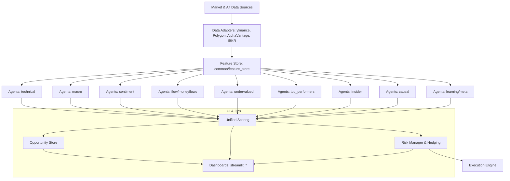
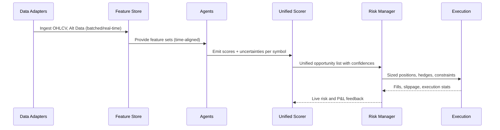

# Trading Intelligence System — Technical Plan and Approach

Version: 1.0  
Owner: Core Engineering  
Date: 2025-08-19

## Executive Summary
This document provides a comprehensive, implementation-ready technical plan for the Trading Intelligence System. It details data ingestion, feature engineering, model architectures per agent, orchestration, scoring, risk/hedging, execution, evaluation, and MLOps. It is tailored to the existing repository structure and components, with explicit feature- and model-level specifications for each agent family.

## Goals and Success Criteria
- Robust multi-agent, multi-signal trading intelligence spanning technical, macro, sentiment, flow, value/undervalued, top performers, insider-like patterns, causal inference, hedging, and learning/meta layers.
- Deterministic reproducibility and auditable lifecycle for data, features, models, decisions.
- Best-in-class risk-adjusted performance; focus on generalization under regime shifts.
- Modular and testable components aligned with the existing codebase and CI tests.

Key success KPIs:
- Precision/recall on opportunity classification; AUC > 0.70 for individual agents, > 0.78 for unified ensemble (target values adjustable).
- Live-to-backtest slippage < 30% on alpha contribution (measured via matched trade logs and paper/live trading).
- Portfolio-level Sharpe > 1.5 and Calmar > 1 with max drawdown < 15% over target universes, given risk constraints.

## Architecture Overview

Core components in repo:
- Data adapters and sources: `common/data_adapters/*` (yfinance, Polygon, AlphaVantage, IBKR, multi-asset)
- Feature store and schemas: `common/feature_store/`, `schemas/*.json`
- Agents (by domain): `agents/*`
- Scoring and opportunity store: `common/scoring/unified_score.py`, `common/opportunity_store.py`
- Eventing/bus: `common/event_bus/bus.py`
- Risk and execution: `risk_management/advanced_risk_manager.py`, `execution_algorithms/advanced_execution.py`
- Dashboards and demos: `streamlit_*`, `launch_*`, `run_*`, `demo.py`
- ML models: `ml_models/*`

## Data Layer

### Sources
- Market data: prices, volumes, OHLCV via `yfinance`, `PolygonAdapter`, `AlphaVantageAdapter`.
- Real-time intraday feeds (Polygon), corporate actions, splits, fundamentals (if enabled).
- Alternative data: sentiment sources under `agents/sentiment/sources.py`, economic releases via `agents/macro/economic_calendar.py`, geopolitics via `agents/macro/geopolitical_monitor.py`.
- Broker/execution connectivity: `common/data_adapters/ibkr.py` (for order routing and reference data where applicable).

### Adapters
- `common/data_adapters/base.py`: common interface.
- `.../yfinance_adapter*.py`: batched historical fetch, retries, rate-limits.
- `.../polygon_adapter.py`: real-time and historical with API keys in `.env`/`env_real_keys.env`.
- `.../multi_asset_adapter.py`: cross-asset unification.

### Data Contracts and Schemas
- Market data schema: `schemas/market_data.json`.
- Agent-specific schemas: `schemas/*.json` (e.g., `technical.json`, `macro.json`, `sentiment.json`, etc.).
- Contract for features: typed columns, window definitions, missingness policy, timezone normalization (UTC), symbol normalization.

### Quality & Validation
- Checksums and sample counts per fetch.
- Gaps, duplicates, outliers detection; winsorization policy.
- Time alignment with exchange calendars; forward-fill rules for daily features used at intraday horizons must avoid leakage.

## Feature Engineering

Global policies:
- All engineered features versioned with a semantic name `feature_family/version` and saved to `data/parquet/...` with timestamped partitions.
- Feature generation must be idempotent and deterministic; seeds fixed; window definitions explicit.
- Leakage avoidance: only use data available up to decision timestamp; align macro/sentiment to decision time via asof joins and embargo windows.

Below, features per agent family.

### Technical Agent Features (`agents/technical/*`)
- Price/volume-derived indicators across multiple timeframes:
  - Momentum: 1/5/10/20/60-day returns; intraday k-bar momentum.
  - Trend: SMA/EMA/HMA/VWAP distances; MACD; ADX; KAMA slope.
  - Volatility: ATR, Parkinson, Garman-Klass; realized variance; intraday vol-of-vol.
  - Mean reversion: Z-score of returns, Bollinger band width/position.
  - Volume/flow proxies: OBV, Money Flow Index, volume spike z-scores.
  - Microstructure: bid-ask proxy via high-low spread ratios; range vs. volume.
- Cross-sectional features:
  - Relative strength vs. sector/industry ETF; percentile rank within universe.
  - Beta to market/sector; residuals from Fama-French-like regressions (if available).
- Regime features:
  - HMM/Markov-switching regime probabilities; volatility regime flags; drawdown state.

Targets:
- Classification: probability of positive risk-adjusted return over horizon H (e.g., next day/week), with holding-cost/fee-adjusted labels.
- Regression: expected alpha (excess return vs. benchmark) with robust loss.

### Macro Agent Features (`agents/macro/*`)
- Economic calendar derived event indicators: surprise scores (actual - consensus), recency decay.
- Rates/credit curves: slope, curvature, carry; macro regimes via PCA of macro series.
- Cross-asset signals: equity-bond correlation shifts; commodities/FX spillovers.
- Geopolitical risk indices and event flags from `geopolitical_monitor.py`.

Targets:
- Regime classification (risk-on/off/stagflation) and directional tilts for sectors/styles.

### Sentiment Agent Features (`agents/sentiment/*`)
- Text-derived embeddings/scores:
  - Transformer-based sentiment (`ml_models/transformer_sentiment.py`), entity-linked.
  - Lexicon signals, subjectivity, uncertainty, stance toward tickers/entities.
- Volume/velocity features: mention velocity, burstiness, source credibility weights; bot detection via `bot_detector.py`.
- Market alignment: price reaction around news windows; impact-adjusted sentiment.

Targets:
- Short-horizon drift probability post-news; abnormal return probabilities; event-driven opportunity classification.

### Flow and Moneyflows Agents (`agents/flow/*`, `agents/moneyflows/*`)
- Order flow and liquidity:
  - Cumulative volume delta (CVD), imbalance, iceberg detection proxies.
  - VWAP/TRIN deviations; opening/closing auction imbalances.
  - Dark-pool proxy features where supported by feeds.
- Capital rotation:
  - Factor flows across sectors/styles; ETF creation/redemption inferred flows.
  - Rolling net inflow/outflow proxies from volume and relative performance.

Targets:
- Probability of continuation/reversal conditional on imbalance and liquidity regimes.

### Undervalued/Value Agent Features (`agents/undervalued/*`)
- Relative value and quality proxies from price-based signals when fundamentals limited:
  - Value: price vs. rolling intrinsic proxy (e.g., sector-neutral mean reversion, dividend yield proxy if available).
  - Quality: volatility/earnings proxy via realized vol and return stability; downside deviation; drawdown recovery speed.
  - Mispricing indices: deviation from cross-sectional expected return given risk factors.
- If fundamentals available (Polygon/other): P/E, P/B, EV/EBITDA, revenue growth, margin trends, buyback/insider activity signals.

Targets:
- Medium-horizon expected alpha and re-rating probability.

### Top Performers Agent Features (`agents/top_performers/*`)
- Momentum persistence: multi-horizon momentum stack with turnover penalties.
- Trend robustness: consistency scores across timeframes, pullback depth, trend maturity.
- Risk-adjusted momentum: information ratio on rolling windows; crash sensitivity.

Targets:
- Probability of sustained outperformance vs. benchmark with stopout constraints.

### Insider-like Agent Features (`agents/insider/*`)
- Proxy for insider information flow:
  - Unusual options activity (if available) or implied by price/volume skews.
  - Clustered news/sentiment bursts with low-latency reaction.
  - Corporate event proximity (earnings, guidance, M&A rumors) and price path signatures.

Targets:
- Event-driven jump likelihood and directionality.

### Causal Agent Features (`agents/causal/*`)
- Time-lagged causal graph features: PCMCI/Granger-inspired dependencies across macro, sector, and micro signals.
- Intervention variables: policy moves, rate decisions, shocks.

Targets:
- Counterfactual uplift in expected return under hypothetical policy/event regimes; causal strength scores.

### Learning/Meta Agent Features (`agents/learning/*`)
- Meta-features capturing agent agreement/disagreement, entropy, calibration error.
- Feature importance stability and drift signals.

Targets:
- Optimal blending weights or gating decisions for agent ensembling; meta-opportunity scores.

## Modeling Specifications

Global modeling policies:
- Train/validation/test with walk-forward, expanding-window CV; embargo periods to prevent leakage.
- Losses: classification — focal loss or class-balanced cross-entropy; regression — Huber or quantile losses.
- Calibration via isotonic regression or temperature scaling; monitored per regime.
- Uncertainty estimation: ensemble variance and MC dropout where applicable.

### Model Families per Agent
- Technical: Gradient Boosted Trees (XGBoost/LightGBM) on engineered features; Temporal CNN/LSTM for sequence inputs; hybrid models with attention over multi-timeframe features.
- Macro: Bayesian Structural Time Series, Hidden Markov Models for regimes, gradient boosting for tilts.
- Sentiment: Transformer fine-tuning for domain-specific sentiment; linear/GBM heads for mapping to returns; sequence models for news flow.
- Flow/Moneyflows: Tree models for tabular flow features; temporal models for imbalance sequences; logistic regression baselines for interpretability.
- Undervalued: Tree/linear hybrids, generalized additive models for smooth value proxies; optional neural nets for non-linear interactions.
- Top performers: Tree-based ranking models (LambdaMART) and momentum-specific classifiers.
- Insider-like: Event classifiers with survival analysis for time-to-jump; hazard models.
- Causal: Two-stage models — causal discovery then predictive models restricted to causal parents; doubly robust estimators for uplift.
- Learning/Meta: Stacking/Blending/Ensemble with `ml_models/ensemble_predictor.py`; gating via softmax over agent confidences.

### Targets and Labeling
- Define horizon H per agent: technical (1D/1W/intraday), sentiment (minutes–days), macro (weeks–months), undervalued (weeks–months), flow (minutes–days), top performers (weeks), insider (event horizon), causal (scenario).
- Labels computed with trade-cost-aware excess returns vs. benchmark; robust to outliers; class balance techniques for rare events.

### Hyperparameter Strategy
- Bayesian optimization with time-series aware CV splits.
- Early stopping and regularization tuned per agent.
- Feature selection via SHAP-based stability, permutation importance, and drift-aware pruning.

## Orchestration and Dataflow

Components:
- Event bus: `common/event_bus/bus.py` to publish data updates, feature readiness, model signals.
- Feature store: `common/feature_store/store.py` for cache and retrieval; parquet snapshots under `data/*/parquet`.
- Agents: modular runners under each domain (`agents/*/agent*.py`), including real-data and optimized variants.
- Unified scoring: `common/scoring/unified_score.py` combines agent outputs into a single opportunity score; configs in `config/scoring_weights.yaml`.
- Opportunity store: `common/opportunity_store.py` persists ranked opportunities; surfaced to dashboards.
- Risk/Hedging: `risk_management/advanced_risk_manager.py` integrates constraints and hedging overlays.
- Execution: `execution_algorithms/advanced_execution.py` for order slicing and microstructure-aware execution.

Scheduling:
- Historical batch: Makefiles or Python schedulers via `full_demo_run.py`, `run_demo.py`, tests drive CI execution.
- Real-time/intraday: Polygon-driven updates; debounced event streams; stateful agents with warm caches.

## Scoring and Decisioning

Unified Scorer combines:
- Per-agent scores normalized to [0,1] with calibration.
- Weighting schemes:
  - Static weights in `config/scoring_weights.yaml` with constraints.
  - Meta-learned weights from `agents/learning/*` conditioned on regime features.
- Confidence and uncertainty integrated via conservative adjustments.
- Final output: ranked opportunities with expected alpha, confidence, risk tags, and suggested horizon.

## Risk Management and Hedging

- Pre-trade checks: exposure caps (asset, sector, factor), liquidity constraints, borrow availability for shorts.
- Sizing: Kelly-fraction bounded, drawdown-aware; volatility-scaling with min/max position bounds.
- Hedging:
  - Market beta hedges via index/sector futures/ETFs.
  - Tail risk hedges conditional on volatility regime.
  - Pair and basket hedges for relative-value themes.
- Stop/exit policies: volatility-based stops, time stops, signal decay monitoring.
- Aggregation: portfolio-level risk budget and turnover penalties.

## Execution

- Order placement via `execution_algorithms/advanced_execution.py` with the following capabilities:
  - Participation rate bounds; VWAP/TWAP scheduling; opportunistic liquidity capture.
  - Smart limit price offsets based on microstructure proxies.
  - Slippage models updated from live fills; adaptive aggressiveness.
- Broker adapters (e.g., IBKR) configurable for paper/live staging.

## Evaluation and Backtesting

- Backtest engines within `agents/technical/backtest.py` and agent-specific demos; system-level tests in `tests/*` and `test_*.py`.
- Metrics:
  - Classification/regression: AUC, Brier, calibration error, MAE/MAPE for alpha.
  - Portfolio: Sharpe, Sortino, Calmar, MaxDD, turnover, hit rate, avg win/loss, exposure.
  - Live alignment: post-trade slippage, realized impact, tracking error vs. simulated.
- Methodology:
  - Walk-forward backtests with realistic execution constraints and costs.
  - Purged K-fold CV (embargoed) for model selection.
  - Ablations per feature family, per agent; sensitivity to hyperparameters and data granularity.

## MLOps and Reproducibility

- Environments: pinned `requirements.txt`; Docker via `docker-compose.yml` for services; `.env` for keys.
- Data versioning: timestamped parquet snapshots; optional DVC integration (future work) for large artifacts.
- Model registry: versioned model artifacts by agent, horizon, universe; metadata includes training window, features, metrics, SHAP summaries.
- CI: use `pytest` suites in repo; lints and unit tests; golden datasets for regression tests.
- Monitoring: drift detection on features and residuals; performance monitoring with alerting thresholds.

## Security and Compliance

- Secrets management: `.env` local; recommend Vault/KMS for production.
- Rate-limit and fair use compliance with data providers; backoff and retry with jitter.
- Auditability: immutable logs of data versions, model versions, decisions, and trades.

## Rollout Plan and Milestones

Phase 1 — Foundations (Weeks 1–2):
- Solidify data adapters and feature store contracts; regenerate baseline features to `data/parquet/...`.
- Implement deterministic labeling for each agent horizon; add tests.
- Baseline models per agent (GBM/logistic) with walk-forward CV.

Phase 2 — Orchestration & Scoring (Weeks 3–4):
- Integrate agents with unified scoring; implement calibration and uncertainty.
- Connect to risk manager; basic hedges; paper trading loop with execution engine.
- Streamlit dashboards integrated for monitoring opportunities and P&L.

Phase 3 — Advanced Modeling (Weeks 5–7):
- Add temporal deep models for technical, sentiment transformers, and causal constraints.
- Hyperparameter optimization and feature stability selection.
- Robust ablations; finalize meta-learning weights.

Phase 4 — Harden & Go-Live (Weeks 8–9):
- Monitoring, drift, alerting; live-to-sim validation.
- Security review; secret rotation; production runbooks.

## Detailed Feature Tables (Abbreviated)

### Technical (example)

| Feature | Description | Window/Params |
|---|---|---|
| ret_1d, ret_5d, ret_20d | Simple returns | 1/5/20 trading days |
| sma_gap_10, sma_gap_50 | Price − SMA | 10/50 days |
| atr_norm | ATR / price | 14 days |
| mfi | Money Flow Index | 14 days |
| bb_pos, bb_width | Bollinger position/width | 20 days, 2σ |

### Sentiment (example)

| Feature | Description | Notes |
|---|---|---|
| s_trf | Transformer sentiment score | from `transformer_sentiment.py` |
| s_vel | Mention velocity | per hour/day |
| s_unc | Uncertainty/subjectivity | normalized |

### Flow (example)

| Feature | Description | Notes |
|---|---|---|
| cvd | Cum. volume delta | intraday bins |
| imb | Order book imbalance proxy | high/low-based |
| vwap_dev | Price − VWAP | intraday |

(Expand tables per agent as features are finalized; store definitions in `schemas/*.json`).

## Configuration and Extensibility

- Scoring weights: `config/scoring_weights.yaml`
- Agent configs: per-agent Python dataclasses or YAML (future), including horizons, features on/off, thresholds, and costs.
- Plugin pattern: new agents implement `fit/predict` contracts and publish to event bus; auto-discovered by orchestrator.

## Implementation Checklist

- Data
  - [ ] Validate all adapters and env keys; record data coverage and gaps.
  - [ ] Rebuild feature snapshots; verify schema conformity.
- Modeling
  - [ ] Implement labeling and CV pipelines per agent.
  - [ ] Train baselines; log metrics and calibration.
  - [ ] Add deep/advanced models where beneficial.
- Orchestration
  - [ ] Wire agents → unified scorer → risk → execution → dashboards.
  - [ ] Persist opportunities and decisions; add audit logs.
- Evaluation
  - [ ] Run walk-forward backtests; add ablations.
  - [ ] Validate paper/live loop; compare to sim.
- MLOps
  - [ ] Pin versions; add CI checks; drift monitors.

## References
- Existing repository modules under `agents/*`, `common/*`, `ml_models/*`.
- Standard literature on multi-factor models, regime detection, causal discovery, and execution algorithms.

---
This document is designed to be actionable with the current codebase. As components evolve, update the feature schemas, agent specs, and scoring configuration to keep all downstream systems consistent and reproducible.
